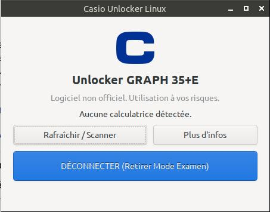
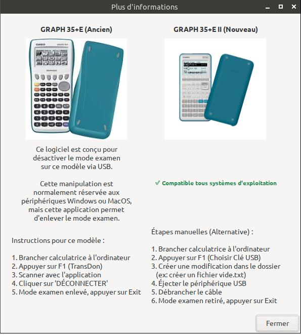

# Casio Unlocker Linux 🔓


**Casio Unlocker Linux** est une application native légère (écrite en C avec GTK3) permettant de **désactiver le Mode Examen** sur les calculatrices Casio (notamment la **Graph 35+E**) directement sous Linux.

Ce logiciel comble un manque, car le logiciel officiel Casio n'est disponible que sur Windows et macOS.

---

## 📸 Aperçu

Voici à quoi ressemble l'interface :


*Interface principale pour scanner et déconnecter.*


*Fenêtre d'informations et d'aide.*

---

## ⚠️ Avertissements Importants

> **Ce logiciel n'est pas officiel.** Il a été développé par rétro-ingénierie du protocole USB Casio. L'utilisation se fait à vos propres risques.

> 🧪 **État du test :** Ce logiciel a été développé et testé avec succès sur **une seule calculatrice physique** (Casio Graph 35+E). Bien que le protocole soit standard, des variations peuvent exister d'un modèle à l'autre.

---

## 📋 Compatibilité

| Modèle | Compatibilité | Remarques |
| :--- | :---: | :--- |
| **Casio Graph 35+E** (USB) | ✅ **Oui** | Cible principale de ce logiciel. |
| **Casio Graph 35+E II** | ℹ️ **Inutile** | Ce modèle fonctionne comme une clé USB (voir section "Informations"). |
| **Autres modèles (90+E, etc.)** | ❓ **Expérimental** | Le logiciel détectera la calculatrice, mais le protocole de déverrouillage peut différer. |

**Système d'exploitation :** Fonctionne sur toute distribution Linux (Debian, Ubuntu, antiX, Fedora, Arch...) disposant des bibliothèques GTK3 et Libusb.

---

## 📥 Installation

Vous avez deux choix : télécharger l'application prête à l'emploi OU la compiler vous-même.

### Option 1 : Télécharger l'application (Recommandé)
Pas besoin de compiler.

1. Allez dans la section **[Releases](../../releases)** de ce dépôt.
2. Téléchargez le fichier **`CasioUnlocker_Linux.AppImage`** (ou le `.zip`).
3. Rendez le fichier exécutable :
   ```bash
   chmod +x CasioUnlocker_Linux.AppImage

## 📜 Licence

Ce projet est Open Source. Vous êtes libre de le modifier et de le redistribuer.